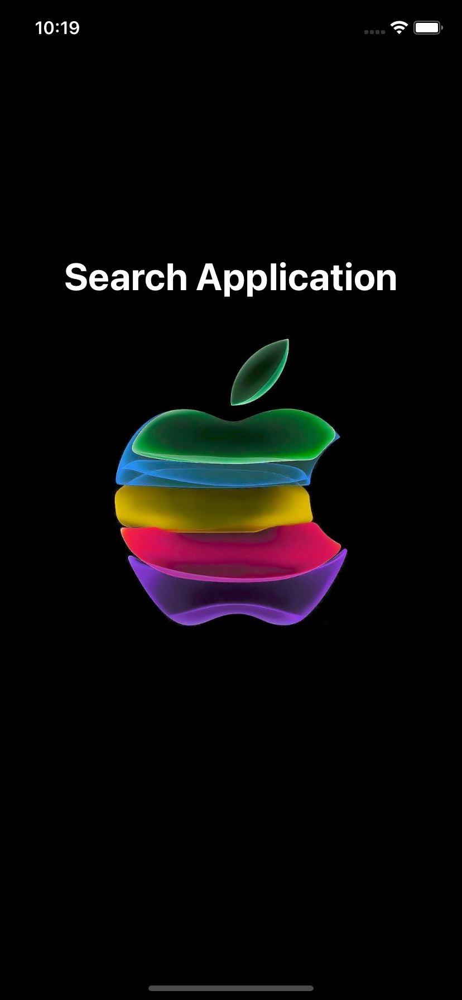
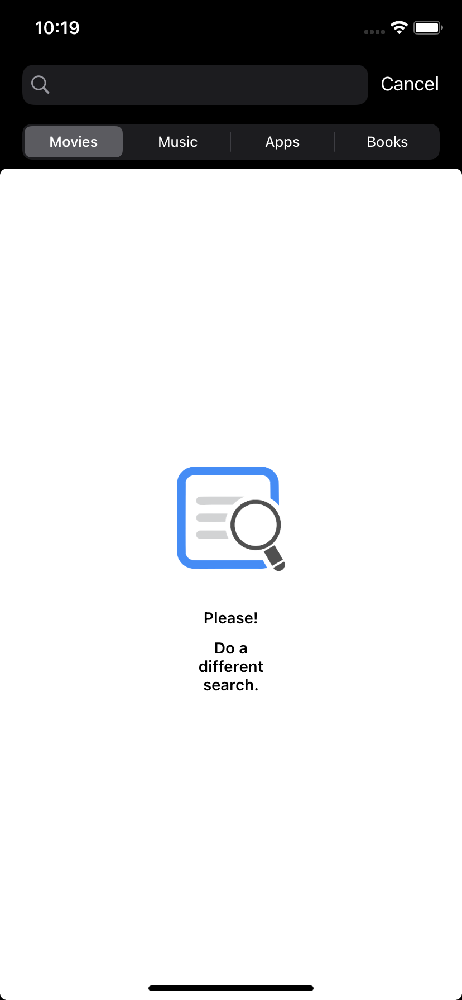
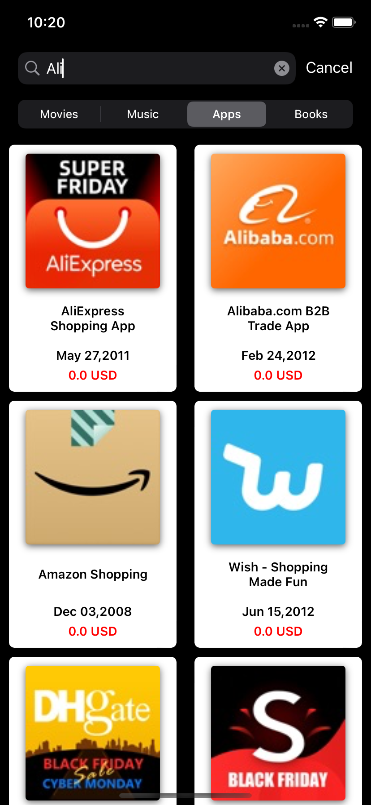

# İtunes Search 
#### *Final Project for Hepsiburada iOS Bootcamp*

   

## Table of Contents
- <a href="#description">Description</a>
- <a href="#tech-stack">Tech Stack</a>
- <a href="#libraries">Libraries</a>
- <a href="#implementation-and-features">Implementation and Features</a>
- <a href="#requirements">Requirements</a>

## Description

İtunes Search is a final project for the Hepsiburada iOS Bootcamp.
The project was made as a small demo of the search area in Hepsiburada.Users will be able to perform the search by typing what they want to search in the search bar and choosing from the radio button in the submenu. Search related information will be listed.When you scroll down the screen, new information will be listed.If the user wants , can go to the detail page by clicking on it.
After going to the detail page, it can return to the main page.

## Tech Stack

* MVVM, delegation patterns for bindings 
* Swift Package Manager
* image caching
* Building Programmatic UI
* Splash Screen Design

## Libraries

* NetworkPackage https://github.com/erkutbas/DefaultNetworkOperationPackage
## Implementation and Features

| Splash Screen | Home Screen | Search Screen | Detail Screen | App |      
| --- | --- | --- | --- | --- | 
| |  |  | |  | 

## Requirements

* Xcode 12.5
* Swift 5
* iOS 15.0
* Only portrait mode 

